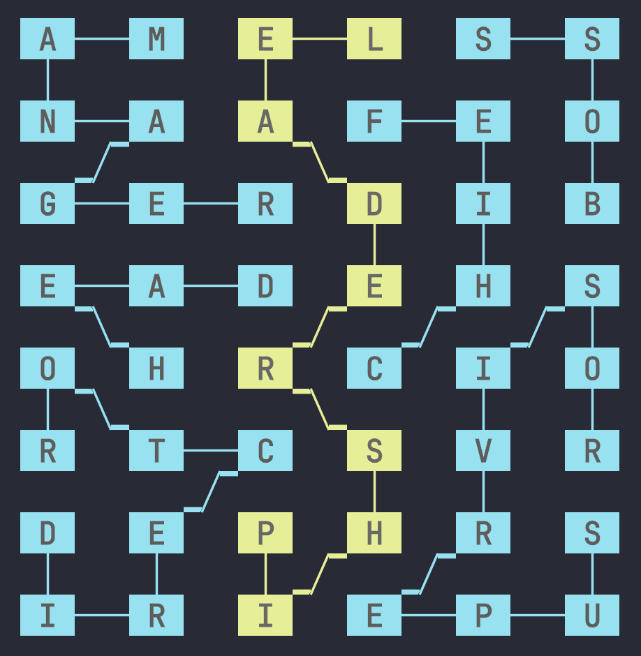

# Strands Solver

A solver for Strands, the New York Times puzzle game.

## Prerequisites

- Install the [uv](https://docs.astral.sh/uv/) package manager.
- (Optional) Set the `GEMINI_API_KEY` environment variable to a valid [Gemini API key](https://ai.google.dev/gemini-api/docs/api-key). A free tier key is sufficient for solving puzzles, though it may take longer due to rate limits. Using a paid tier key is faster but incurs a tiny cost: typically $0.00001–$0.0001 per puzzle.

> [!NOTE]
> Without a GEMINI_API_KEY the solver will try to find valid solutions but it can't accurately determine which solution is best.

## Basic Usage

```bash
uv run strands-solver solve today  # solve today's puzzle
uv run strands-solver solve YYYY-MM-DD  # solve another day's puzzle
uv run strands-solver solve path_to_puzzle.json  # solve puzzle from a file
```

## Goal

This program attempts to solve Strands puzzles in one shot, i.e. without a way to iteratively determine whether the chosen words are correct or not.

More precisely, given

- a rectangular grid of letters
- a phrase describing a theme
- a number specifying the number of words in the solution

the solver attempts to find a set of _strands_ (sequences of adjacent letters in the grid) such that

- every letter in the grid is covered exactly once
- every strand is at least 4 letters long
- there is at least one strand (called the _spangram_) which spans the entire grid vertically or horizontally and which explains the theme
- every strand spells out a valid word (though the spangram may be a concatenation of multiple words)
- all strands are somehow related to the theme
- the number of strands matches the given number of words

> [!NOTE]
> There may be multiple strands in a solution which span the entire grid, but only one is deemed the spangram.

### Example

This is the puzzle of 2025-10-03:

```
Theme: Who's in charge?

 A     M     E     L     S     S

 N     A     A     F     E     O

 G     E     R     D     I     B

 E     A     D     E     H     S

 O     H     R     C     I     O

 R     T     C     S     V     R

 D     E     P     H     R     S

 I     R     I     E     P     U

Number of words: 7
```

The goal is then to find this solution:



where the strands are

```
🟡 LEADERSHIP (spangram)
🔵 BOSS
🔵 CHIEF
🔵 DIRECTOR
🔵 MANAGER
🔵 SUPERVISOR
🔵 HEAD
```

This is the "correct" solution as provided by the New York Times. There are other valid solutions, but not all match the theme.

## Results

The solver has been validated and benchmarked on a set of official puzzles. Currently, it solves a subset of puzzles correctly. The results are recorded in [RESULTS.md](./RESULTS.md).

## Advanced Usage

The CLI provides four commands: `solve`, `show`, `benchmark`, and `embed`.

### `solve`

Solve a Strands puzzle.

```bash
uv run strands-solver solve today                     # solve today's puzzle
uv run strands-solver solve YYYY-MM-DD                # solve another day's puzzle
uv run strands-solver solve path_to_puzzle.json       # solve puzzle from a file
uv run strands-solver solve today -o ./solutions      # write all solutions to a directory
```

### `show`

Display the official solution for a puzzle from the NY Times API (not used for solving).

```bash
uv run strands-solver show today
uv run strands-solver show YYYY-MM-DD
```

### `benchmark`

Benchmark the solver against a set of puzzles. Results are saved to a Markdown file.

```bash
uv run strands-solver benchmark                                  # default: 2025-09-01 to 2025-09-30
uv run strands-solver benchmark -s 2025-10-01 -e 2025-10-31      # custom date range
uv run strands-solver benchmark -t 30                            # 30 second timeout per puzzle
uv run strands-solver benchmark -r ./my_results.md               # custom results file
```

### `embed`

The solver uses semantic embeddings to determine which solution best fits the theme. These embeddings are
generated while solving a puzzle and cached for future re-use. However, when solving many puzzles (such as when
running a benchmark), you may run into rate limits for the embedding API. To avoid this, you can generate
embeddings ahead of time.

Embedding the entire dictionary costs about $0.10 and takes about 60 minutes on a paid (Tier 1) Gemini project
(based on 2025-12-30 pricing and rate limits). While it's technically possible to do on the free tier, this would
take a very long time due to rate limits. Storing the embeddings database also uses about 2 GB of disk space.

To generate dictionary embeddings:

```bash
uv run strands-solver embed            # embed words not already cached
uv run strands-solver embed --reload   # re-embed all words
```

The embeddings database is stored in `data/embeddings/embeddings.db`.

## Motivation

I started this project to try out modern coding agents on a non-trivial but easy to validate problem. I expected a little vibe-coding would get me most of the way there, but the problem proved to be a lot more challenging than I thought! Along the way though, I learned to collaborate with my coding agent in a way that truly extended my abilities.

My first idea was simple. First, I'd find all words in the grid by looking at each cell and taking steps in all directions, stopping if it was not a valid prefix of a word in the dictionary. Then, to cover the grid I'd just try all combinations of found words, ignoring combinations where words overlap (which I assumed would often be the case). The word finding worked first try, but the covering was extremely slow. It just never completed.

To find out why, I asked my coding agent for help. I have some basic knowledge of complexity analysis, but I first wanted to refresh my memory. I prompted:

> how do i estimate the computational complexity of a backtracking algorithm?

After grasping the basics, I asked:

> how would you estimate my algo in @solver.py? start simple and add more nuance after

It explained that my algo had a worst-case complexity of $O(2^M)$ with $M$ being the number of candidate words (typically 1000-2000). This was completely infeasible!

So let's make it faster!

> The puzzles I want to solve have N = 48 and M ~= 2000. What are some ways I could improve my algorithm in @solver.py to make this tractable? Think about different angles, start with the simplest/closest to my current algo and give 2 better options if they exist.

It gave me three options for algorithms, none of which I had ever heard of. It explained that the worst-case complexity was still exponential (as the problem is NP-complete), but that we could massively speed things up by always picking the cell with the smallest number of strands covering it, and recurse from there (a heuristic called MRV).

Of course I asked it to implement the new algo, and it worked! I was now able to cover the grid in just a few minutes for most puzzles. (I did lose the chat history for this step, unfortunately.)

I was really happy with this workflow. My coding agent could look at my code, suggest improvements I never would have thought of, implement them and make huge performance gains. I did end up rewriting some of the code to better fit my mental model and to fully understand it, as I found this was necessary to keep making improvements. But here too the agent was invaluable in helping me understand the existing code.

> [!TIP]
> I've added an [export of my chat](./assets/cursor_algo_analysis.md) where I asked for analysis and algo suggestions.

## Limitations

- Some puzzles take a very long time to solve (see [notes.md](./puzzles/notes.md)).
- The solver will only find a solution if the spangram is a single word or a concatenation of words which are each 4 letters or longer. In reality, the words in a concatenated spangram may be shorter than 4 letters.
- The solver usually finds multiple solutions but it doesn't always choose the solution that best fits the theme.
- The solver will not find solutions where the spangram contains a contraction (like YOURE), which does appear in real solutions.
- The dictionary (`dictionary.py`) uses the [ENABLE1](https://rressler.quarto.pub/i_data_sets/data_word_lists.html) word list, which is comprehensive but may occasionally miss some valid words or include uncommon ones. This may cause the solver to fail to find a valid solution.

## Development

### Tests

```bash
uv run pytest         # unit + integration tests
uv run pytest -m e2e  # end-to-end tests
```

We use three types of tests:

- **Unit tests** (`tests/unit/`) are fast and reliable because they have no external dependencies.
- **Integration tests** (`tests/integration/`) call external APIs but test individual components.
- **End-to-end tests** (`tests/e2e/`) run the full application through the CLI.

By default, end-to-end tests are skipped because they are slower and may potentially be flaky.

### Type Checking

```bash
uv run pyright
```

### Formatting

```bash
uv run ruff format
```
